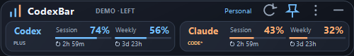
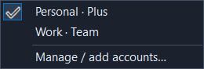

# CodexBar for Windows

A small, movable Windows overlay for Codex and Claude coding quota.
Unofficial Windows implementation inspired by [steipete/CodexBar](https://github.com/steipete/CodexBar).
Not affiliated with OpenAI or Anthropic.

Current release: **v0.4.1**. Session and Weekly values display fully, including `100%`.



## Features

- Compact horizontal overlay: 400 × 64 logical pixels, movable and always-on-top.
- Blue Codex and orange Claude session/weekly remaining quota.
- Reset countdowns below each meter; unavailable source timestamps show Reset unknown.
- Tray icon, refresh, opacity settings, remembered placement and quota details.
- Codex account menu: save current, add via official CLI browser login, rename and switch.
- Saved Codex logins protected with Windows CurrentUser DPAPI.
- Claude Code OAuth and Claude Desktop Code live API quota/reset times, including Store installs.



## Install

Windows 10/11 x64. Download the portable ZIP from this repository's **Releases**,
extract the entire folder, then run `CodexBar.exe`. The release includes .NET.
Keep the executable with its supporting files. Quit an older instance before upgrading.

Sign in to Codex/Claude Code first, or select Claude Desktop as the source in Settings.
Drag the header to move. Click Codex's name for accounts; click quota meters for details.
Right-click or use ⋮ for settings. Escape hides to tray; double-click the tray icon restores it.

See [user guide](docs/USER-GUIDE.md) for account setup, shortcuts and source settings.
See [release notes](docs/RELEASE-v0.4.1.md) for this version's changes.

## Account switching and limitations

Save current login once, then use **Sign in another** to add another ChatGPT account.
Close Codex Desktop/CLI and VS Code before switching, then reopen them afterward.
Switching updates the configured Codex home's `auth.json`; it cannot hot-switch an
already-running client or a client using a separate credential store.

File-based Codex login is supported. Explicit keyring/auto/ephemeral storage is refused.
Actual second-account Desktop behavior is not verified; synthetic switching and Windows
encryption checks pass. CodexBar does not refresh OAuth tokens; reauthenticate through
the official CLI or Desktop when required. Claude Desktop mode verifies the Code
credential's account/organization and reads fresh quota/reset times from Anthropic.
**CODE*** marks a verified Code session whose organization could not be compared to
Desktop's current selection because its cookie database is locked. Hover/click for the
organization and qualification. Multiple plausible Code organizations are refused.
See [Claude Desktop setup and sources](docs/CLAUDE-DESKTOP.md). Provider APIs/storage
formats may change. Historical quota samples are never used as current quota.

This is an unsigned development release. Windows may show a SmartScreen prompt.
Other upstream providers, local cost history, auto-update and ARM64 are not implemented.

## Build

Install the .NET 10 SDK on Windows, then run PowerShell from the repository root:

```powershell
./scripts/build.ps1
./scripts/test.ps1
./scripts/package.ps1
```

The package script publishes a self-contained win-x64 app, runs synthetic UI checks,
and produces a ZIP and SHA256 checksum in `dist/`. Tests use synthetic credentials,
fake HTTP and a synthetic login subprocess; they do not alter your real login.
The icon generator can be run with `./scripts/build-icon.ps1`.

## Privacy

Quota requests go to fixed provider HTTPS endpoints, with redirects disabled.
Normal refresh reads credentials. Desktop mode decrypts the selected profile's OAuth
cache in memory and reads its organization cookie when available. It never extracts
web session cookies, copies cookie databases, modifies Desktop login or reads other
browsers/process memory. Explicit account actions save encrypted login copies
under `%LOCALAPPDATA%\CodexBarWindows\accounts`; settings live beside that directory.
No telemetry or token logging. Do not share that directory, your `auth.json`, or login logs.
The screenshots above contain synthetic data only.

## Contribute

Bug reports and contributions are welcome. Include app version, Windows version,
provider/source and reproduction steps. Redact account emails and never attach credentials.
Read [CONTRIBUTING.md](CONTRIBUTING.md) and [SECURITY.md](SECURITY.md).

MIT licensed. The original CodexBar copyright notice is preserved in [LICENSE](LICENSE).
See [THIRD-PARTY-NOTICES.md](THIRD-PARTY-NOTICES.md) for upstream/runtime attribution.


Live Claude Desktop Code API readings matched Desktop's Usage page for
Session/Weekly percentages and reset times. See [verification](docs/VERIFICATION.md)
for tested versions, the CODE* source qualification and remaining compatibility limits.
